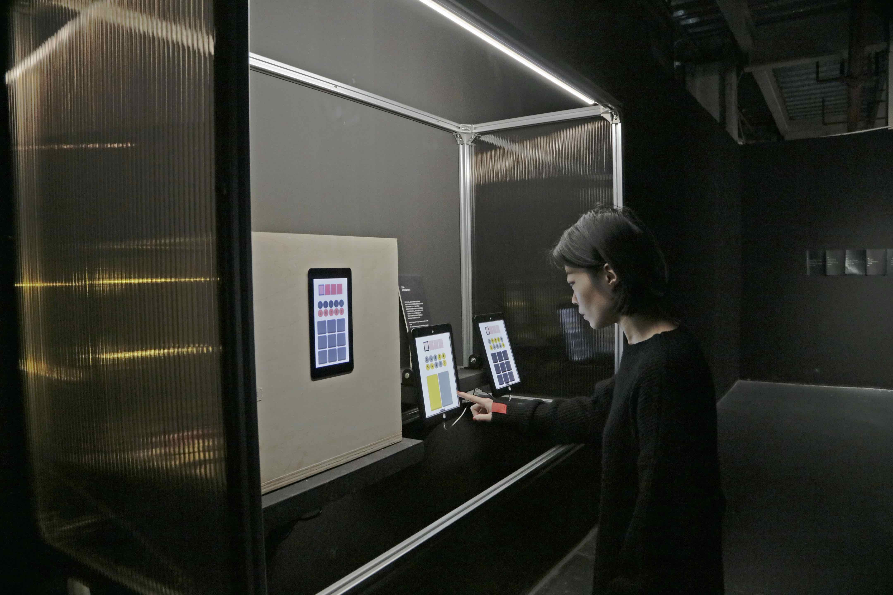
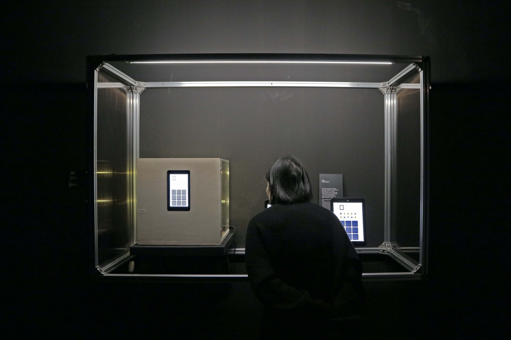
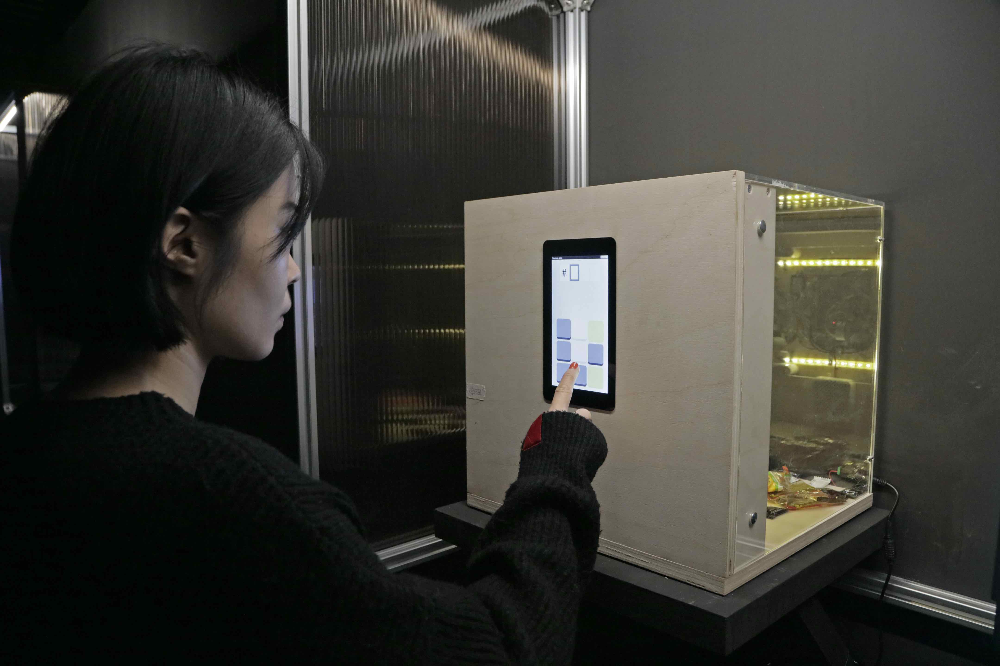
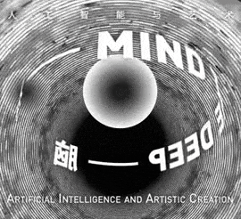
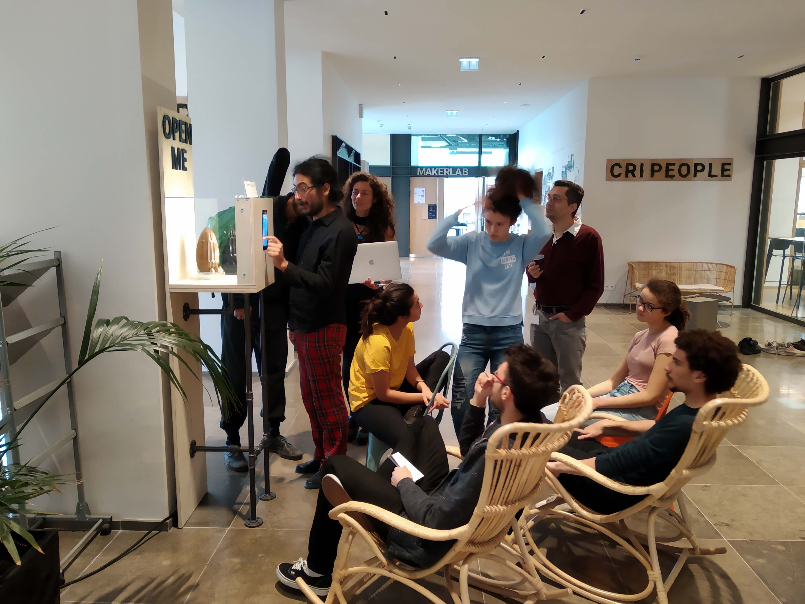
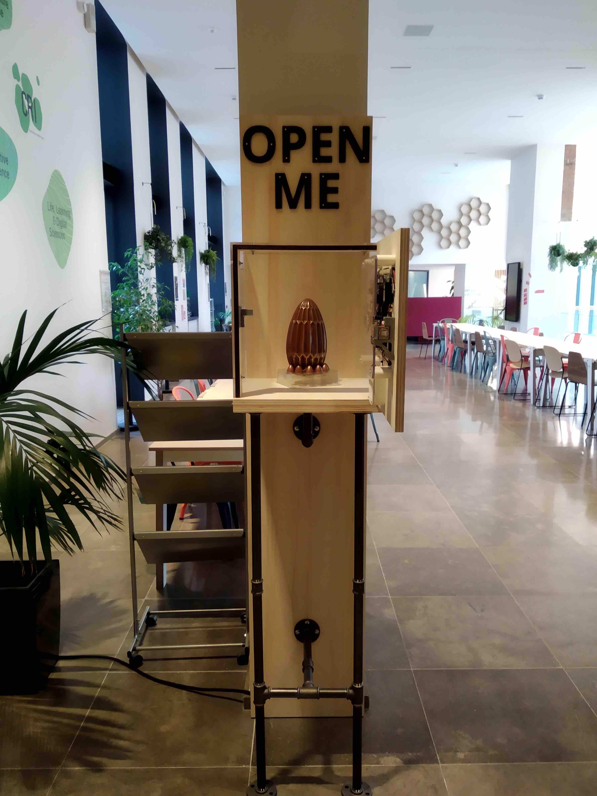
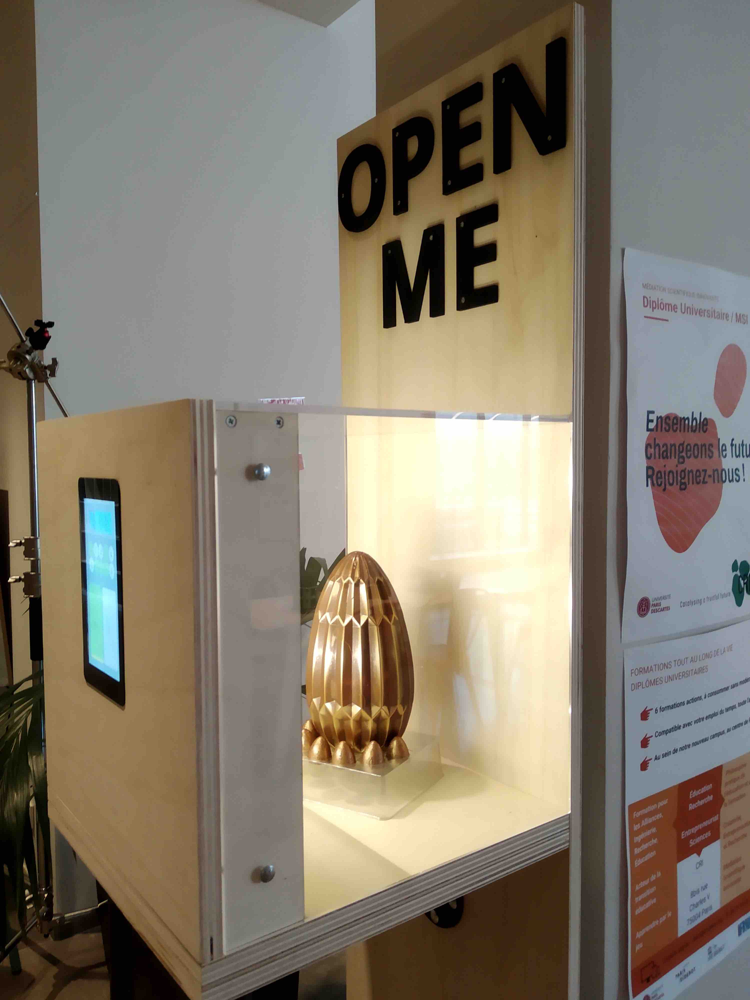

# Transparent Vault

  

    

    
    

  

The transparent vault was exhibited at the ["Mind The Deep"](https://www.wired.com/beyond-the-beyond/2019/10/mind-deep-artificial-intelligence-artistic-creation-shanghai/) exhibition at [MCAM](http://www.mcam.io/) the Shanghai Ming Contemporary Art Museum, upon invitation from [Baoyang Chen](https://baoyangchen.com/) and [Qiu Zhijie](https://en.wikipedia.org/wiki/Qiu_Zhijie).

It was also shown at the [Nuit Blanche 2019 in Paris](https://www.paris.fr/pages/une-nuit-blanche-en-mouvement-6889) at [CRI](https://www.cri-paris.org/en).

## @MCAM, Shanghai

  

    
  

  

  

    
  

    
  

  

  

    
  

  

## @CRI, Paris

  

    
  

  

  

    
  

    
  

  

## Resources

Download the installation [guidelines](pdf/Guidelines_Vault_Challenge_McaM.pdf).

## Thanks

Thanks to [Baoyang Chen](https://baoyangchen.com/) and [Qiu Zhijie](https://en.wikipedia.org/wiki/Qiu_Zhijie) for inviting me to the exhibition.

