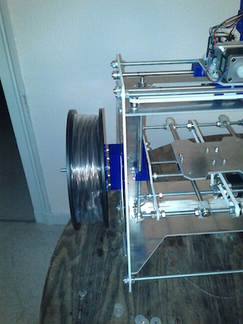

# 3D printer

I built a 3D printer back in 2011 when 3D printing at home was just beginning.

I started with a rough kit shipped from an other maker that I improved in many ways. I added linear roller bearing for the rails, a chain to maintain cables, a holder for the plastic, a case with a fan for the electronics , and other parts to hold things in place. See photos and videos below.

This printer printed the first part of the [Poppy project](https://www.poppy-project.org/) back in early 2012.

  

    
  

    
  

    
  

  

  

    
  

    
  

    
  

  

  

    
  

    
  

    
  

  

  

    
  

    
  

    
  

  

  

    
  

    
  

  

