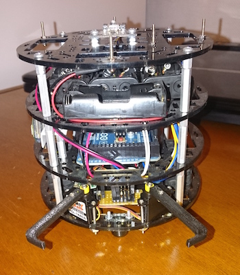
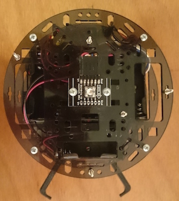
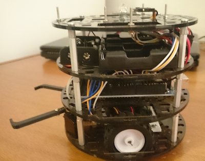
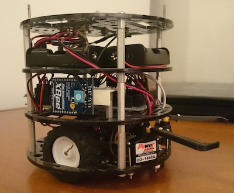
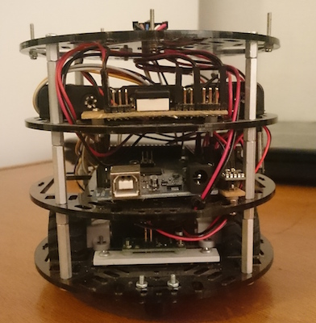
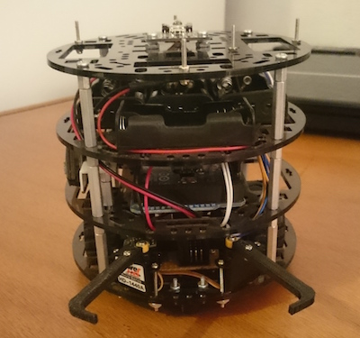

## 2 Wheel Drive Robot

I developed a small 2 wheel drive robot. It is Arduino based with most of the mechanical and electronic parts coming from the [polulu website](https://www.pololu.com/).  There is a small gripper in front that is convenient to perform small tasks with the robot.

I did most of the code on-board including the communication protocol, the encoder management, the speed and position control, LED control, gripper control. The communication with the computer is via Xbee, there is a Python library to control the robot. Finally, there are some Matlab tools to simulate the robot and make it follow a virtual line.

<a class="btn btn-block btn-github btn-lg center" href="https://github.com/jgrizou/robot_2WD" target="_blank">
<i class="fa fa-github"></i> The robot on GitHub
</a>

  
 {{ "qQ2ebGT-qu8" | youtube }} 

  
  

  
  

  
  

  
  

  
  

  
  

