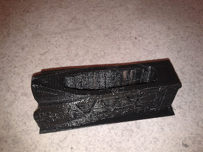
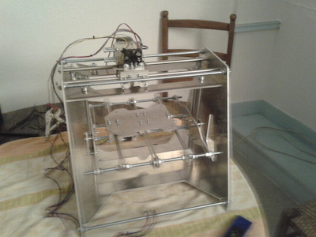
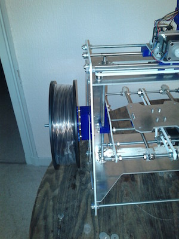
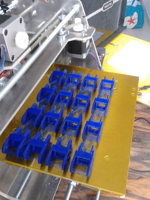
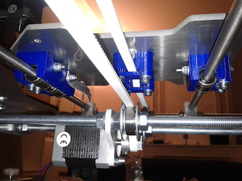
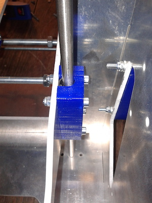
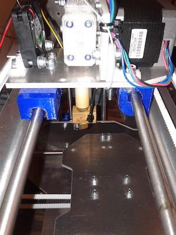
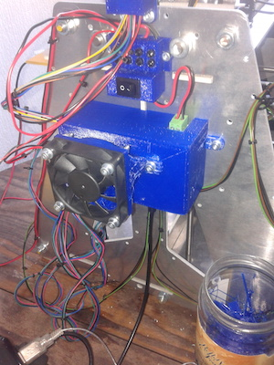

## 3D Printer

I built a 3D printer in 2011. I started with a rough kit and had to build everything. Once I got a first version working, I updated most of the part (the blue parts) with linear roller bearing for the rails, a chain to maintain cables, a holder for the plastic, a case for the electronic with a fan, and several other parts to hold things in place. See photos and videos below.

It was a lot of fun!  I notably printed the first part of the [Poppy project](https://www.poppy-project.org/) with this 3D printer back in early 2012.

  
 {{ "MCbMIJw1MgE" | youtube }} 

  
 {{ "CK_Ua5wZSkU" | youtube }} 

  
 {{ "DBdOaJ1qL4U" | youtube }} 

  
 {{ "4Zq3T_EZOyQ" | youtube }} 

  
  

  
  

  
  

  
  

  
  

  
  

  
  

  
  

  
  

  
  

