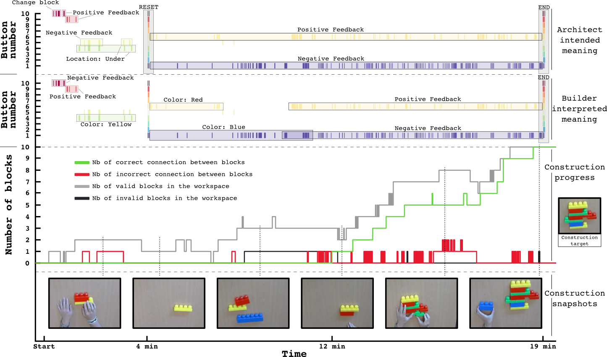

## Studying the Co-Construction of Interaction Protocols in Collaborative Tasks with Humans

In interaction, humans align and effortlessly create common ground in communication, allowing efficient collaboration in widely diverse contexts. Robots are still far away from being able to adapt in such a flexible manner with non-expert humans to complete collaborative tasks. Challenges include the capability to understand unknown feedback or guidance signals, to make sense of what they refer to depending on their timing and context, and to agree on how to organize the interaction into roles and turns. As a first step in approaching this issue, we investigate the processes used by humans to negotiate a protocol of interaction when they do not already share one.

We introduce a new experimental setup, where two humans have to collaborate to solve a task. On the left you is a schematic view of our experimental setup. An architect (bottom) and a builder (top) should collaborate in order to build the construction target while located in different rooms. The architect has a picture of the targeted construction, while the builder has access to the construction blocks. The communication between them is restricted. The problem is illustrated in the video below.

{{ "z98sbYfOdKA" | youtube }}

For our experiment, the setup is more constrained. The architect only sees a top view of the builder’s workspace and can communicate with the builder only though the use of 10 buttons which, when pressed, display symbols on a screen on the builder side. The channels of communication they can use are constrained and force them to invent and agree on a shared interaction protocol in order to solve the task. These constraints allow us to analyze how a communication protocol is progressively established through the interplay and history of individual actions. We report preliminary results obtained from a pilot study, and discuss how the understanding of strategies used by humans could be useful to achieve more flexible HRI.

Above is a timeline for one experiment of an architect and a builder collaborating towards building the construction target (right hand side).  The top and middle part show the timeline of button presses associated with the intended meaning from the architect (top) and the understood meaning from the builder (middle). There were 10 buttons, for which we logged all button presses for each experiment and here display all occurrences as colored dashes. Using the signal meanings participants reported during the game, the events are annotated with the meaning the architect intended or the builder understood. Events that are not annotated were not mentioned by the participants. At the bottom, the figure additionally visualizes the progress made by the builder in assembling the target structure and also shows incorrect block propositions, joining of incorrect blocks and mistakes. These events were annotated by hand. A block proposition here started, when the transportation of the block towards the workspace ended and the block lay still on the table. It ended when the block was again picked up and subsequently removed from the workspace. These presentation events were classified into correct and incorrect propositions by determining whether the proposed block was part of the target structure. Equivalently, a joining event started, when two blocks were successfully joined at either a correct or incorrect position (again depending on whether the resulting configuration was part of the target structure). It ended before the first frame in which the two previously joined blocks were again pulled apart.

### Related Publications

{{ ["vollmer2014studying"] | pub_list}}

### Resources

<a href="https://github.com/jgrizou/paper_conference_icdl_2014" target="_blank" class="btn btn-default" role="button">Paper + some documents</a>
<a href="https://github.com/jgrizou/buttonbox" target="_blank" class="btn btn-default" role="button">Code for the button box</a>
<a href="{{ "/Public/internships/chloe_rozenbaum/" | dropbox_link }}" target="_blank" class="btn btn-default" role="button">Internship data of Chloé Rozenbaum</a>
<a href="{{ "/Public/coco_game/" | dropbox_link }}" target="_blank" class="btn btn-default" role="button">Experimental Data</a>

