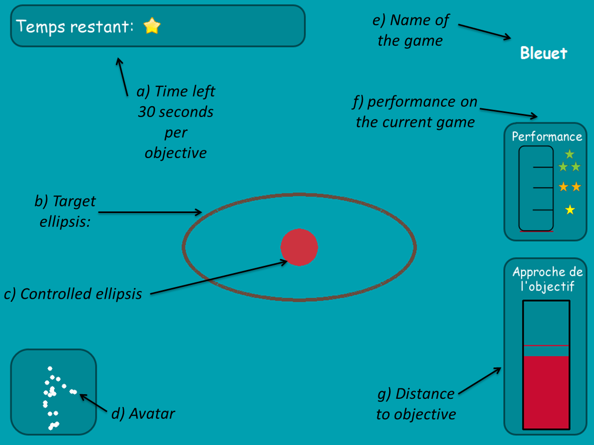

## Experimental study of mechanisms of spontaneous exploration and curiosity in humans

Curiosity is a key element of human development, driving us to explore spontaneously novel objects, activities and environments. Curiosity-driven exploration strategies permit us to interact, learn, and evolve quickly in an open ended world.

We designed a game to analyze and measure properties of curiosity-driven exploration of a priori unknown sensorimotor spaces guided by intrinsic motivation. More specifically, we are interested in the relation between exploration and learning progress.

The setup consist of a kinect tracking the motion of a human. A shape on the screen change as the human moves but the mapping between human's movements and shape changes is unknown to the human. The human must explore the space of movements to learn how to produce arbitrary shapes proposed on the screen.

{{ "95383753" | vimeo }}

There were four games. each displaying a different shape and using a different position to shape mapping. The human can select the game he wants to play and change as many times as he wishes. In each game, the subject's goal is to match the randomly generated shape displayed on the screen. When reached, i.e. when the controlled shape is maintained close enough from the target for one second, a new goal is automatically generated. Objectives change every 30 seconds when not reached. Additional performance indicators were displayed to the subjects in order to improve intrinsic motivation, implication, and comprehension.

Each of the four games, while visually similar, differs by the difficulty of the underlying mapping (more or less easy to learn). Typically, for each of this mapping, the axes of the ellipsis are controlled by one of the body joint: e.g. the major axis will be controlled by the pitch angle of the left shoulder while the minor axis will be controlled by the yaw angle of the right elbow.

This project was pursued by two consecutive internship students: Julie Goliot and Brice Miard. Unfortunately, this line of work was not continued but I would be happy to provide more details if you are interested.

### Related Publications

{{ ["miard2014new"] | pub_list}}

### Resources

<a href="https://github.com/jgrizou/poster_conference_icdl_2014_curiosity" target="_blank" class="btn btn-default" role="button">Paper + Poster</a>
<a href="{{ "/Public/internships/brice_miard/" | dropbox_link }}" target="_blank" class="btn btn-default" role="button">Internship data of Brice Miard</a>

