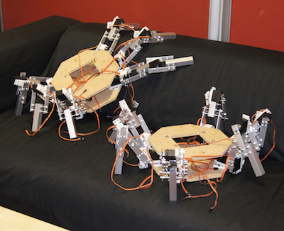
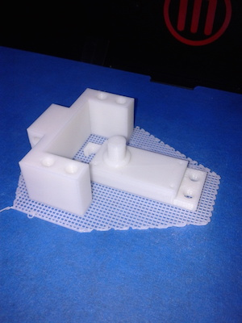

## Hexapod Robot

Together with [Jérome Bechu](http://jerome.bechu.org/) we have been prototyping a hexapod robot. Each leg has 3 degrees of freedom and is made of simple metal part with rather cheap, but really strong, [servomotors](http://www.hobbyking.com/hobbyking/store/__9617__Turnigy_Metal_Gear_Servo_60g_15_5kg_16sec.html). We redesigned, and 3D printed, the back part of the servomotors in order to have an axis on both sides.

<a class="btn btn-block btn-github btn-lg center" href="https://github.com/bechu/hexapod" target="_blank">
<i class="fa fa-github"></i> The robot on GitHub
</a>

  
  

  
  

