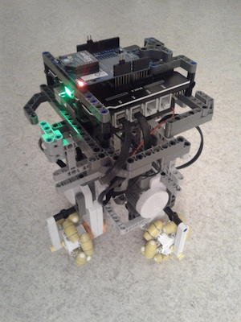
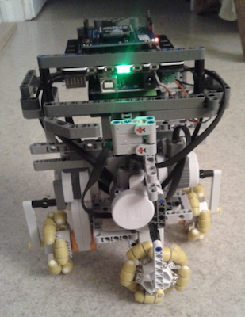

## Omniwheel Robot

I developed an omniwheel robot. I am using Lego for the structure, motors, and few sensors. An [Arduino mega](http://jgrizou.com/projects/omniwheel-robot/ArduinoBoardMega2560) board controls the motors and sensors using a special [NXshield](http://www.generationrobots.com/en/401132-nxshield-m-for-arduino-mega-or-adk-mindsensors.html). The robot was then controlled using a computer via ROS ([ROS package for Arduino](http://wiki.ros.org/rosserial_arduino/Tutorials)). Communication was going through [Xbee](https://www.sparkfun.com/pages/xbee_guide). I further added an [IMU](https://www.sparkfun.com/products/10736).

That was a fun project! Check the photos and videos below.

<a class="btn btn-block btn-github btn-lg center" href="https://github.com/jgrizou/robot_omniwheel" target="_blank">
<i class="fa fa-github"></i> The robot on GitHub
</a>

  
 {{ "QA5YDpNemBs" | youtube }} 

  
 {{ "TJ0GHP1UyZs" | youtube }} 

  
 {{ "X_OtlW4fYc4" | youtube }} 

  
 {{ "QdeRQv6128g" | youtube }} 

  
  

  
  

