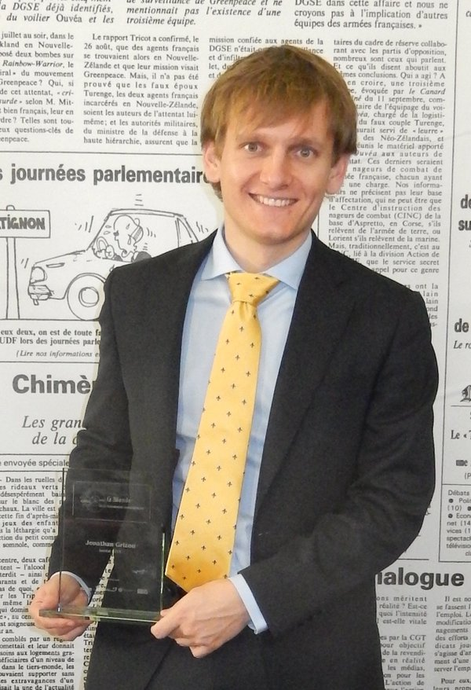

## Prix Le Monde de la Recherche Universitaire 2015

I received the ''Prix Le Monde de la Recherche Universitaire'' 2015 for my thesis work. Each year, this price is awarded to 5 young French scientists across all fields of science. [Cédric Villani](http://cedricvillani.org/) was chairing the jury.

[[Official website]](http://www.lemonde.fr/kiosque/recherche/laureats/prix-recherche-laureats-2015.html)

During my Phd studies, I investigated how a machine can be taught a new task from unlabeled human instructions, which is without knowing beforehand how to associate the human communicative signals with their meanings. I applied my work in the field of brain machine interfaces.

**Related projects:** [[thesis_defense]]({{ "/projects/thesis_defense/" | web_path }}), [[self_calibration_bci]]({{ "/projects/self_calibration_bci/" | web_path }}) and [[learning_from_unlabelled_instructions]]({{ "/projects/learning_from_unlabelled_instructions/" | web_path }})

A book featuring a short summary of each laureate will be published by the end of 2016.

### Resources

### In French

<a href="{{ "/Public/prix_le_monde/article_application_prix_le_monde.pdf" | dropbox_link }}" target="_blank" class="btn btn-default" role="button">Article de candidature</a>

## In the Press

### In French

- [[Article Inria]]( http://www.inria.fr/centre/bordeaux/actualites/j.-grizou-laureat-du-prix-le-monde-de-la-recherche-universitaire)

- [[Huffington Post: ma thèse en deux minute.]](http://www.huffingtonpost.fr/2016/02/08/ordinateur-lire-pensees-ma-these-en-deux-minutes_n_9168306.html)

  
 {{ "http://www.ultimedia.com/deliver/generic/iframe/mdtk/01590560/src/l3ps8u/zone/1/showtitle/1/" | video }} 

