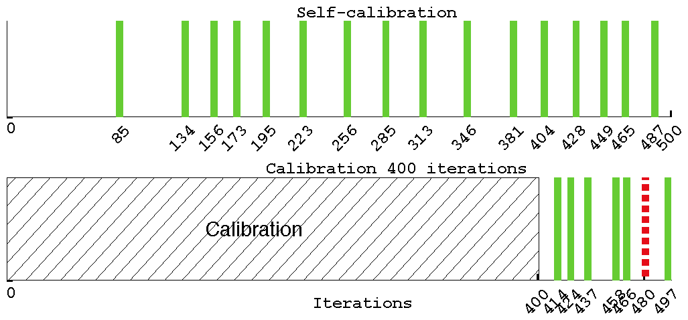
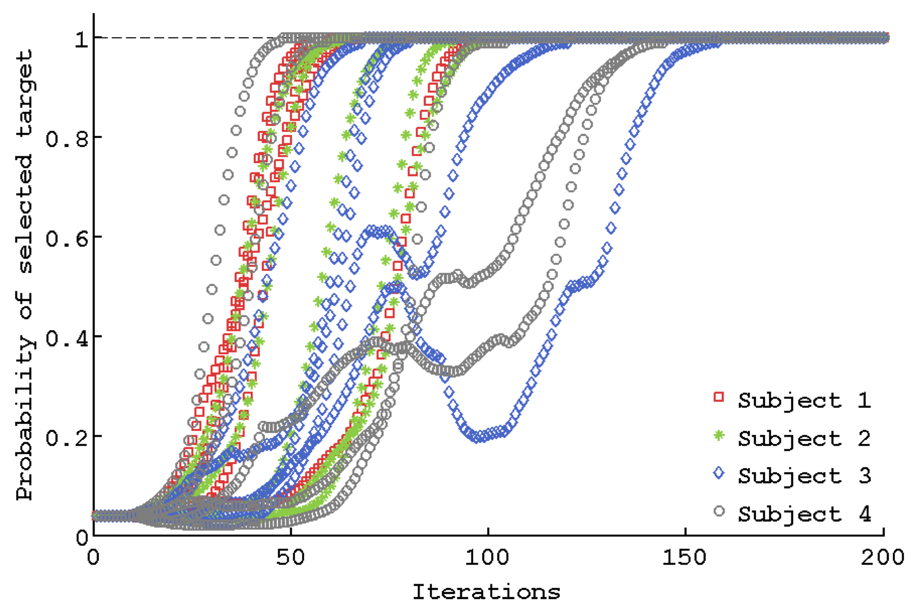

## Self-Calibrated BCI

Recent works have explored the use of brain signals to directly control virtual and robotic agents in sequential tasks. So far in such brain-computer interfaces (BCI), an explicit calibration phase was required to build a decoder that translates raw electroencephalography (EEG) signals from the brain of each user into meaningful instructions. We propose a method that removes the calibration phase, and allows a user to control an agent to solve a sequential task.

<a class="btn btn-block btn-github btn-lg center" href="https://github.com/flowersteam/self_calibration_BCI_plosOne_2015/" target="_blank">
<i class="fa fa-github"></i> Code is available on GitHub
</a>

<a class="btn btn-block btn-default btn-lg center" href="{{ "/publications/iturrate2015exploiting" | web_path}}">
<i class="fa fa-github"></i> Main Publication
</a>

As illustrated by the figure below, the usual calibration procedure (bottom) runs for a fixed period of time (400 iterations here) before the user can actually start controlling the device. With our method (top), the system is able to estimate when sufficient evidences are accumulated and can solve a first task after only 85 iterations in this case.

The proposed method assumes a distribution of possible tasks, and infers the interpretation of EEG signals and the task by selecting the hypothesis which best explains the history of interaction. The method principle is an extension to our project on [Learning From Unlabelled Instructions](../learning_from_unlabelled_instructions/), you will find more detailed information on the overall challenges on that page.

The main idea is depicted in the figure above for a toy 1D example. A user wants the device to reach the right-most state. For each device’s action, he provides a feedback signal which encode whether the action executed is “correct” or “wrong” according to the intended target.  However, neither the user’s desired target nor the labels associated to the user’s feedback signals are known in advance. Considering that we can define a finite set of task hypotheses (in this example we define 3 possibles target state form left to right), we can infer the labels that should be provided by the user with respect to each hypothesis. Then, given a particular interaction history, it is possible to compute a different signal decoder for each task hypothesis (colored data at the bottom). The key point is that only the correct hypothesis will assign the correct labels to all feedback signals (left), while the other hypotheses will gradually mix both classes as the hypothetic target gradually differs more from the correct one (middle, right). Therefore, the hypothesis which provides the decoder with best accuracy and compactness (i.e. the one on the left) can be selected as the most probable one.

We report experiments where users use BCI to control an agent on a 5×5 virtual grid world to reach a target without any previous calibration process. For each subject, the system was able to identify the correct target in less than 200 iterations. We note that a usual calibration procedure requires between 300 and 600 calibration steps.

### Related Publications

{{ ["iturrate2015exploiting", "grizou2014calibration",  "grizou2014learning",  "grizou2014interactive"] | pub_list}}
