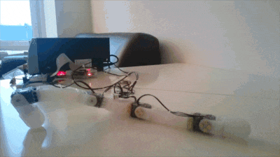
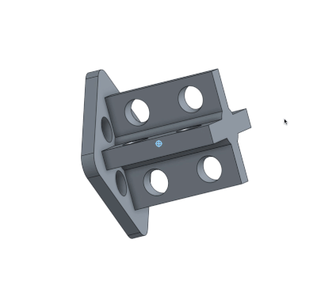

## Soft connector

I have been working on a way to easily (and cheaply) design and include soft elements in poppy creatures. I came up with [poppy-soft-connector](https://github.com/poppy-project/poppy-soft-connector) and I developed [poppy-soft-starfish](https://github.com/poppy-project/poppy-soft-starfish) as a proof of concept.

  
  

  
  

The idea is simple: by embedding hard connectors into silicon based parts, we create soft part with a standard Ollo mechanical interface. These parts can they be used as plug and play building blocks.

To create the soft part you have to prepare a mold of the desired shape. The mold's wall should be 2.2mm thick (for Ollo rivets) and include Ollo holes at the position you would like to add the connectors. The connectors are then positioned into the mold and maintained in place using Ollo rivet. You can then pour the polymer of your choice into the mold and allow for enough time for the polymer to cure - thus embedding the connector into the part. The soft part can then be unmolded and attached with XL-320 motors or any Ollo parts to create 'soft robots'. The starfish robot4 demonstrates how to use soft connectors.

{{ "B3CZs55AJQo" | youtube }}

The possibilities are immense as many different kinds of polymer can be used with many different properties. It also allows to embed electronics, sensors, cables, and more into the body of our robots. The soft connector I designed is neither the smartest nor the only way to go but it is a good starting point. More specialized connectors will have to be designed for different applications. I propose that we share them all on the following repository: poppy-soft-connector12.

I hope this will tickle the imagination and creativity of some of you. I am convinced it will open new possibilities for artistic minded people!

### Useful links

- Discuss the project on the Poppy forum: [https://forum.poppy-project.org/t/poppy-soft-connector/2152](https://forum.poppy-project.org/t/poppy-soft-connector/2152)
- Github of the soft-connector: [https://github.com/poppy-project/poppy-soft-connector](https://github.com/poppy-project/poppy-soft-connector)
- Github of the soft-starfish robot: [https://github.com/poppy-project/poppy-soft-starfish](https://github.com/poppy-project/poppy-soft-starfish)

Both github repository provide instructions on how to build soft components.

